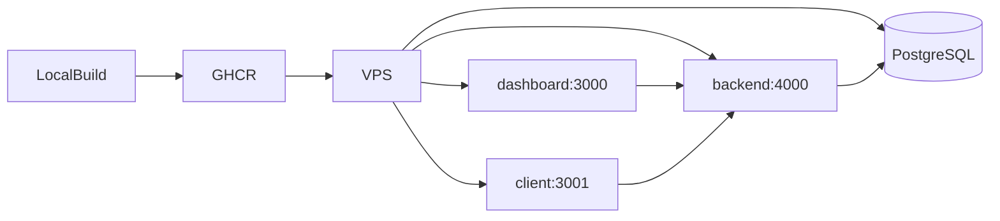

# Blogy

[](https://github.com/ghaninia/blogy/actions/workflows/ci.yml)

Bilingual admin dashboard and API for managing a modern blog — posts, pages, media, portfolio, and more. Built as a TypeScript monorepo with Next.js, Express, Prisma, and a shared UI kit.

## Stack

| Layer | Tech |
|-------|------|
| Dashboard | Next.js 15, React 19, next-intl (FA/EN) |
| Client | Next.js 15, React 19, next-intl (FA/EN) |
| API | Express, Zod, Prisma, PostgreSQL |
| UI | `@gh/ui` design system (glass theme, RTL) |
| Dev ops | Docker Compose, pnpm workspaces, GitHub Actions |

## Project structure

```
blogy/
├── src/
│   ├── backend/       @gh/backend — REST API
│   ├── dashboard/     @gh/dashboard — admin panel
│   ├── client/        @gh/client — public site
│   └── packages/ui/   @gh/ui — shared components
├── docker/            Dockerfiles & entrypoint scripts
├── docker-compose.yml dev stack (db + api + dashboard + client)
├── docker-compose.prod.yml production stack (GHCR images)
├── uploads/           media files (gitignored, .gitkeep only)
└── Makefile           Docker shortcuts
```

## Quick start (Docker)

```bash
make init
make dev
```

| Service | URL |
|---------|-----|
| Dashboard | http://localhost:3000/fa/dashboard |
| Client | http://localhost:3001 |
| API health | http://localhost:4000/health |

More commands: `make logs`, `make dev-db`, `make down`, `make clean` — see [docker/README.md](docker/README.md).

## Quick start (local)

```bash
pnpm install
cp .env.example .env
make dev-db
pnpm db:generate && pnpm db:migrate && pnpm db:seed
pnpm dev
```

## Default accounts (after seed)

| Role | Email | Password |
|------|-------|----------|
| Admin | admin@example.com | Admin@123456 |
| Editor | editor@example.com | Editor@123456 |
| Author | author@example.com | Author@123456 |

## Scripts

| Command | Description |
|---------|-------------|
| `pnpm dev` | Run API + dashboard + client |
| `pnpm dev:backend` | API only |
| `pnpm dev:dashboard` | Dashboard only |
| `pnpm dev:client` | Client only |
| `pnpm build` | Production build |
| `pnpm lint` | Lint all packages |
| `pnpm db:migrate` | Run migrations |
| `pnpm db:seed` | Seed database |
| `make dev` | Full Docker dev stack |
| `make dev-db` | PostgreSQL only |

## Environment

Copy `.env.example` to `.env`. Key variables:

| Variable | Description |
|----------|-------------|
| `DATABASE_URL` | PostgreSQL connection string |
| `JWT_ACCESS_SECRET` / `JWT_REFRESH_SECRET` | Auth secrets (min 32 chars; change in production) |
| `NEXT_PUBLIC_API_URL` | Public API URL for frontends |
| `NEXT_PUBLIC_SITE_URL` | Public site URL (client) |
| `CORS_ORIGIN` | Allowed origins for API |
| `POSTGRES_*` | Database credentials (Docker) |
| `RECAPTCHA_*` | reCAPTCHA keys (optional) |

## CI

GitHub Actions runs on every push/PR to `main`:

1. `pnpm install --frozen-lockfile`
2. `pnpm db:generate`
3. `pnpm lint`
4. `pnpm build`

Build-time env vars are set in [`.github/workflows/ci.yml`](.github/workflows/ci.yml) as placeholders. Production values are configured on the VPS.

## Deployment (Docker → GHCR → VPS)

Production flow: build Docker images locally or on a build machine, push to GitHub Container Registry (GHCR), then pull and run on a VPS with `docker-compose.prod.yml`.

### Architecture



### 1. Prerequisites

- Docker & Docker Compose on build machine and VPS
- GitHub account with access to `ghaninia/blogy`
- A GitHub Personal Access Token (PAT) with `write:packages` and `read:packages` scopes

### 2. Login to GHCR

```bash
echo "$GITHUB_TOKEN" | docker login ghcr.io -u YOUR_GITHUB_USERNAME --password-stdin
```

### 3. Build & push images

From the repo root, set your image tag (use a git SHA or version):

```bash
export IMAGE_TAG=latest   # or: $(git rev-parse --short HEAD)

docker build -f docker/Dockerfile.backend   -t ghcr.io/ghaninia/blogy-backend:${IMAGE_TAG}   .
docker build -f docker/Dockerfile.dashboard \
  --build-arg NEXT_PUBLIC_API_URL=https://api.yourdomain.com \
  -t ghcr.io/ghaninia/blogy-dashboard:${IMAGE_TAG} .
docker build -f docker/Dockerfile.client \
  --build-arg NEXT_PUBLIC_API_URL=https://api.yourdomain.com \
  --build-arg NEXT_PUBLIC_SITE_URL=https://yourdomain.com \
  -t ghcr.io/ghaninia/blogy-client:${IMAGE_TAG} .

docker push ghcr.io/ghaninia/blogy-backend:${IMAGE_TAG}
docker push ghcr.io/ghaninia/blogy-dashboard:${IMAGE_TAG}
docker push ghcr.io/ghaninia/blogy-client:${IMAGE_TAG}
```

Make GHCR packages **public** (or configure VPS docker login for private packages).

### 4. Prepare the VPS

On the server:

```bash
mkdir -p ~/blogy && cd ~/blogy
```

Copy these files to the VPS:

- `docker-compose.prod.yml`
- `.env` (production values — see below)

Or clone the repo and use only the compose file + `.env`.

### 5. Production `.env`

Create `.env` on the VPS from `.env.example` and set production values:

```bash
# --- PostgreSQL ---
POSTGRES_USER=blogy
POSTGRES_PASSWORD=<strong-password>
POSTGRES_DB=blogy

# --- API ---
NODE_ENV=production
API_PORT=4000
JWT_ACCESS_SECRET=<random-32+-chars>
JWT_REFRESH_SECRET=<random-32+-chars>
CORS_ORIGIN=https://admin.yourdomain.com,https://yourdomain.com

# --- Frontends (public URLs — used at build time AND runtime) ---
WEB_PORT=3000
CLIENT_PORT=3001
NEXT_PUBLIC_API_URL=https://api.yourdomain.com
NEXT_PUBLIC_SITE_URL=https://yourdomain.com
NEXT_PUBLIC_RECAPTCHA_SITE_KEY=
RECAPTCHA_SECRET_KEY=

# --- Media ---
MAX_FILE_SIZE=10485760

# --- Rate limiting ---
RATE_LIMIT_WINDOW_MS=900000
RATE_LIMIT_MAX=500
AUTH_RATE_LIMIT_MAX=10

# --- First deploy only (seed demo data) ---
RUN_SEED=false

# --- GHCR image overrides (optional) ---
GHCR_IMAGE_BACKEND=ghcr.io/ghaninia/blogy-backend:latest
GHCR_IMAGE_DASHBOARD=ghcr.io/ghaninia/blogy-dashboard:latest
GHCR_IMAGE_CLIENT=ghcr.io/ghaninia/blogy-client:latest
```

> **Important:** `NEXT_PUBLIC_*` vars are baked into Next.js at **image build time**. Rebuild and push dashboard/client images whenever these URLs change.

### 6. Start production stack

```bash
docker compose -f docker-compose.prod.yml --env-file .env pull
docker compose -f docker-compose.prod.yml --env-file .env up -d
```

Check status:

```bash
docker compose -f docker-compose.prod.yml ps
curl -sf http://localhost:4000/health
```

The backend entrypoint runs `prisma migrate deploy` automatically on startup.

### 7. Reverse proxy (recommended)

Put Nginx or Caddy in front of the three services:

| Public URL | Upstream |
|------------|----------|
| `https://api.yourdomain.com` | `localhost:4000` |
| `https://admin.yourdomain.com` | `localhost:3000` |
| `https://yourdomain.com` | `localhost:3001` |

Enable HTTPS (Let's Encrypt) and set `CORS_ORIGIN` / `NEXT_PUBLIC_*` to match.

### 8. Updates

On your build machine:

```bash
# rebuild & push new images
export IMAGE_TAG=$(git rev-parse --short HEAD)
# ... docker build & push ...

# on VPS
docker compose -f docker-compose.prod.yml pull
docker compose -f docker-compose.prod.yml up -d
```

### GitHub repository settings

No GitHub Actions secrets are required for CI (checks-only). For manual GHCR push, use a PAT locally. Optional future CD can add:

| Secret | Purpose |
|--------|---------|
| `GITHUB_TOKEN` | Auto-provided; push to GHCR from Actions |
| `VPS_HOST` | SSH host for automated deploy |
| `VPS_SSH_KEY` | SSH private key for deploy |

## License

Private — all rights reserved.
